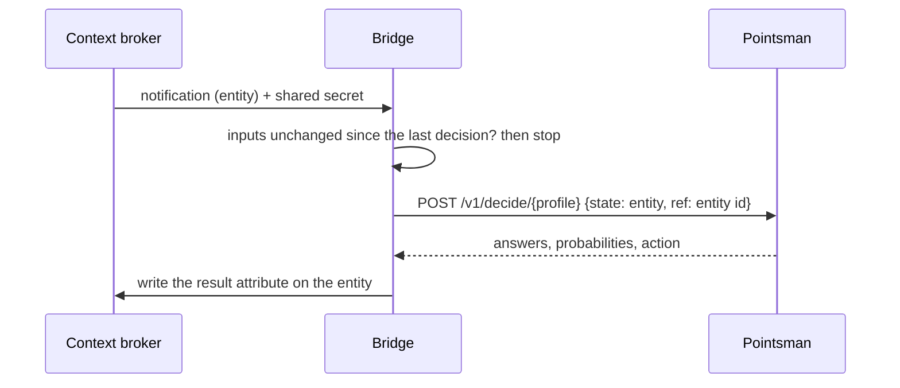

# FIWARE bridge

Connects an NGSI-LD context broker to Pointsman. When an entity is created or
one of its input attributes changes, the broker notifies the bridge; the
bridge asks Pointsman to decide about the entity, and writes the result back
to the entity as one property.



The profile reads the entity as the broker sends it (normalized NGSI-LD), so
there is no mapping code: the input paths in the profile point at the
attributes, for example `$.description.value`. See
[examples/profiles/road-restriction-check.yaml](../examples/profiles/road-restriction-check.yaml).

Background: [docs/spikes/fiware-bridge.md](../docs/spikes/fiware-bridge.md)
(#14, #41). Tried with GeonicDB; the broker check in #41 also covers Orion-LD,
Scorpio and Stellio.

## The result on the entity

One property, named in the configuration (here `check`):

```json
"check": {
  "type": "Property",
  "value": "publish",
  "observedAt": "2026-10-07T03:40:12.120Z",
  "decisionId": { "type": "Property", "value": "be691aa7-…" },
  "decision": { "type": "Relationship", "object": "urn:ngsi-ld:Decision:be691aa7-…" },
  "profile": { "type": "Property", "value": "road-restriction-check" },
  "profileVersion": { "type": "Property", "value": 1 },
  "policyRule": { "type": "Property", "value": "1" },
  "model": { "type": "Property", "value": "clef-flash" },
  "category": { "type": "Property", "value": "closedWeather" },
  "categoryProbability": { "type": "Property", "value": 0.96 },
  "danger": { "type": "Property", "value": false },
  "dangerProbability": { "type": "Property", "value": 0.53 },
  "inputHash": { "type": "Property", "value": "5a2380cd…" }
}
```

- The value is the action, so other applications can subscribe to it or query
  it (`q=check=="urgent"`).
- Each answer and its probability are sub-properties, one level deep (Orion-LD
  drops a third level).
- `decisionId` is Pointsman's decision id: use it to fetch the full record or
  to send feedback.
- `policyRule` is the rule of the profile's policy that gave the action
  (`"0"`, `"1"`, …, or `"default"`): the reason for the result.
- `decision` points to the Decision entity, when the route creates one (below).

## Decision entities

With `"decisionEntity": true` in a route, the bridge also creates one
`Decision` entity per decision, following the draft data model in
[datamodels.jp](https://datamodels.jp/models/decision/Decision/): the answers with their probabilities,
the profile version, the rule, the model, the time, how a person takes part,
and, for profiles with spatial facts, every fact the profile asked for, as
looked up for the decision (`facts`,
see [docs/profile-format.md](../docs/profile-format.md#facts)). Decisions can then be queried across entities, for example all that wait
for a person (`type=Decision&q=reviewStatus=="pending"`).

- The entity is created before the property is written; if the broker refuses
  it, nothing is written and the notification fails (502 when a retry may
  help).
- `humanInvolvement` is `dpv:HumanInvolvementForVerification` (and
  `reviewStatus` `pending`) for the route's `reviewActions` (default
  `["review"]`), `dpv:HumanInvolvementForOversight` for the other actions:
  they are taken, and a person can correct them later through Pointsman's
  feedback.
- The model's terms are sent inline in `@context`, because its context URL is
  not published yet.
- It uses NGSI-LD 1.8 `JsonProperty` and `VocabProperty`, which Orion-LD does
  not accept yet (see [docs/decision-model-standards.md](../docs/decision-model-standards.md)).
  Tried with GeonicDB.

## Chains of decisions

A second route on the same entity type can decide on the first route's
result, for example: a road restriction report is decided `urgent` or
`review` (route 1, attribute `check`), then a second profile asks whether
the closure cuts people off from their evacuation site (route 2).

- Give the second route a `name`, and point its subscription to
  `/notify?route=<name>`. `/notify` without a name serves the type's route
  without a name; each type has at most one of those.
- Its `inputs` include the first route's attribute (`check`), and its
  subscription watches that attribute, with `q` limiting it to the actions
  that should go on (for example `check=="urgent"`).
- `informedBy: "check"`: its Decision entities link the first decision
  (`wasInformedBy`, from `check.decision`), so the chain can be followed in
  the broker.

```json
[
  { "type": "RoadRestriction", "profile": "road-restriction-check", "inputs": ["description"], "attribute": "check", "decisionEntity": true },
  { "type": "RoadRestriction", "profile": "evacuation-access-check", "inputs": ["description", "check"], "attribute": "evacuation",
    "name": "evacuation", "informedBy": "check", "decisionEntity": true }
]
```

## How it avoids loops

The bridge writes to the entity it was notified about. Two things keep that
from starting a new decision:

- It writes with `PATCH …/attrs/{name}` (and `POST …/attrs` the first time),
  never `PATCH …/attrs`: Orion-LD notifies on the latter even for attributes
  the subscription does not watch (#41).
- It stores a hash of the input values (`inputHash`) with the result, and
  ignores a notification whose inputs have that hash. For this the
  notification must include the result attribute: do not limit
  `notification.attributes`, or include the result attribute in it.

A notification about a deleted entity (with `deletedAt`) is skipped.

## Configuration

Variables (`vars` in [wrangler.jsonc](wrangler.jsonc)):

| Name | Meaning |
|---|---|
| `BRIDGE_ROUTES` | JSON list of routes: `type`, `profile`, `inputs` (the attributes the profile reads), `attribute` (where the result goes; must not be an input); optional `decisionEntity` (true: also create Decision entities), `reviewActions` (actions a person checks first, default `["review"]`), `name` and `informedBy` (for chains, below) |
| `POINTSMAN_URL` | Pointsman's base URL |
| `BROKER_URL` | The broker's base URL (without `/ngsi-ld/v1`) |
| `BROKER_TENANT` | Optional: sent as `NGSILD-Tenant`. One bridge serves one tenant. |
| `BROKER_CONTEXT` | Optional: JSON-LD context URL for the writes, when the entity's attribute names are not core terms (for example the datamodels.jp context) |

Secrets (`wrangler secret put <NAME> --config bridge/wrangler.jsonc`, or
`bridge/.dev.vars` for `wrangler dev`):

| Name | Meaning |
|---|---|
| `NOTIFY_SECRET` | Shared secret the subscription sends in `x-bridge-secret`; other notifications are refused |
| `POINTSMAN_TOKEN` | A Pointsman API token limited to the bridge's profiles (`node scripts/tokens.mjs create --client fiware-bridge --profiles road-restriction-check --remote`) |
| `BROKER_TOKEN` | Optional: sent as `Authorization: Bearer …` to the broker |
| `BROKER_API_KEY` | Optional, instead of `BROKER_TOKEN`: sent as `X-Api-Key` (for example a GeonicDB API key; its `allowedOrigins` must include `*`, because the bridge sends no `Origin`) |

URLs must use https; plain http is accepted only for `localhost`.

## The subscription

One per entity type. Watch the profile's input attributes, ask for the
normalized format, and send the shared secret:

```json
{
  "type": "Subscription",
  "entities": [{ "type": "RoadRestriction" }],
  "watchedAttributes": ["roadName", "restrictionStatus", "statusLabel", "description"],
  "notification": {
    "format": "normalized",
    "endpoint": {
      "uri": "https://<bridge>/notify",
      "accept": "application/json",
      "receiverInfo": [{ "key": "x-bridge-secret", "value": "<NOTIFY_SECRET>" }]
    }
  }
}
```

Create it with the same `@context` (Link header) as the entities, so the
attribute names in the notification match the ones in `BRIDGE_ROUTES`.

## Failures and retries

The bridge answers `502` when an entity failed in a way a second try may fix
(Pointsman or the broker not reachable, a 5xx or 429), and `200` otherwise,
also when Pointsman refused the input (a retry would fail the same way). The
response lists what happened to each entity. Entities that succeeded are
skipped on a retry because of the input hash.

Whether a broker sends a failed notification again depends on the broker. If
it does not, the next change of an input decides again. A queue in front of
the bridge (#50) would make retries certain.

## Run it

```sh
pnpm install
cd bridge
../node_modules/.bin/wrangler dev        # local, with bridge/.dev.vars
../node_modules/.bin/wrangler deploy     # with your own copy of wrangler.jsonc
```

Another Worker can mount the bridge instead of running it on its own:
`handleRequest(request, config)` from [src/bridge.ts](src/bridge.ts).

Tests: `pnpm test:worker` (in `test/bridge/`, with a fake broker and
Pointsman).
