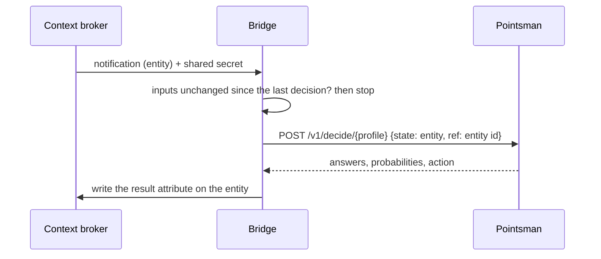

# FIWARE bridge

Connects an NGSI-LD context broker to Pointsman. When an entity is created or
one of its input attributes changes, the broker notifies the bridge; the
bridge asks Pointsman to decide about the entity, and writes the result back
to the entity as one property.

## Why a bridge

FIWARE is open-source software for smart-city data platforms. It uses
NGSI-LD, an open standard for this kind of data and its API (made by ETSI, a
European standards body). At the center of such a platform is a service
called a **context broker**. It keeps **entities** and shares them with apps:
things like a road, a report or a sensor, each with its attributes. Apps can **subscribe** to entities: then the broker sends them a
message (a **notification**) when an entity changes.

Pointsman and a context broker cannot work together directly:

- **Pointsman knows nothing about FIWARE.** It has a simple web API: you
  send it some data, and it answers with a decision. This keeps Pointsman
  usable from anywhere, not only from FIWARE.
- **The broker cannot use Pointsman alone.** It can only send a notification
  to a web address. It cannot turn the notification into a question for
  Pointsman, and it cannot save Pointsman's answer.

The bridge connects the two. It is more than a proxy, which only passes
messages on:

- **It asks.** It receives the broker's notifications. For each entity, it
  asks Pointsman with the right profile.
- **It saves the answer.** It writes the decision back to the broker as
  data, so other apps can use it: on the entity itself, and if you want, as
  separate `Decision` and `Task` entities (models from
  [datamodels.jp](https://datamodels.jp)).
- **It does the extra work.** It ignores the notifications that its own
  writes cause. It can chain decisions, one after another. It finishes a
  review when a person resolves it in the broker or in another app. With a
  queue, it also tries again until a decision is made.

In FIWARE terms, the bridge is a connector (an NGSI-LD adapter: it speaks
the NGSI-LD API of the broker). It is similar to an IoT Agent, which connects
devices to a broker. It is not a FIWARE "Generic Enabler": that is a name
for the components in the official FIWARE catalogue.

The bridge runs as its own Cloudflare Worker (this folder), or inside
another Worker, as in the demo. A city can run it in its own account, next
to its own broker.

## How it works



The profile reads the entity as the broker sends it (normalized NGSI-LD), so
there is no mapping code: the input paths in the profile point at the
attributes, for example `$.description.value`. See
[examples/profiles/road-restriction-check.yaml](../examples/profiles/road-restriction-check.yaml).

Background: [docs/spikes/fiware-bridge.md](../docs/spikes/fiware-bridge.md)
(#14, #41). Tried with GeonicDB; the broker check in #41 also covers Orion-LD,
Scorpio and Stellio.

## The result on the entity

One property, named in the configuration (here `check`):

```json
"check": {
  "type": "Property",
  "value": "publish",
  "observedAt": "2026-10-07T03:40:12.120Z",
  "decisionId": { "type": "Property", "value": "be691aa7-…" },
  "decision": { "type": "Relationship", "object": "urn:ngsi-ld:Decision:be691aa7-…" },
  "profile": { "type": "Property", "value": "road-restriction-check" },
  "profileVersion": { "type": "Property", "value": 1 },
  "policyRule": { "type": "Property", "value": "1" },
  "model": { "type": "Property", "value": "clef-flash" },
  "category": { "type": "Property", "value": "closedWeather" },
  "categoryProbability": { "type": "Property", "value": 0.96 },
  "danger": { "type": "Property", "value": false },
  "dangerProbability": { "type": "Property", "value": 0.53 },
  "inputHash": { "type": "Property", "value": "5a2380cd…" }
}
```

- The value is the action, so other applications can subscribe to it or query
  it (`q=check=="urgent"`).
- Each answer and its probability are sub-properties, one level deep (Orion-LD
  drops a third level).
- `decisionId` is Pointsman's decision id: use it to fetch the full record or
  to send feedback.
- `policyRule` is the rule of the profile's policy that gave the action
  (`"0"`, `"1"`, …, or `"default"`): the reason for the result.
- `decision` points to the Decision entity, when the route creates one (below).

## Decision entities

With `"decisionEntity": true` in a route, the bridge also creates one
`Decision` entity per decision, following the Decision model on
[datamodels.jp](https://datamodels.jp/models/decision/Decision/): the answers with their probabilities,
the profile version, the rule, the model, the time, how a person takes part,
and, for profiles with spatial facts, every fact the profile asked for, as
looked up for the decision (`facts`,
see [docs/profile-format.md](../docs/profile-format.md#facts)). Decisions can then be queried across entities, for example all that wait
for a person (`type=Decision&q=reviewStatus=="pending"`).

- The entity is created before the property is written; if the broker refuses
  it, nothing is written and the notification fails (502 when a retry may
  help).
- `humanInvolvement` is `dpv:HumanInvolvementForVerification` (and
  `reviewStatus` `pending`) for the route's `reviewActions` (default
  `["review"]`), `dpv:HumanInvolvementForOversight` for the other actions:
  they are taken, and a person can correct them later through Pointsman's
  feedback.
- `@context` is the model's published context,
  `https://datamodels.jp/context/decision/v1.jsonld` (`DECISION_CONTEXT`), so
  the broker must be able to fetch it.
- It uses NGSI-LD 1.8 `JsonProperty` and `VocabProperty`, which Orion-LD does
  not accept yet (see [docs/decision-model-standards.md](../docs/decision-model-standards.md)).
  Tried with GeonicDB.

## Task entities

With `"task": {"actions": ["review", "urgent"]}` in a route, the bridge also
creates a `Task` entity for each decision with one of these actions,
following the Task model on
[datamodels.jp](https://datamodels.jp/models/task/Task/). Any app that lists
tasks from the broker (for example Redmine with GTT) then shows the work for
a person, without knowing about Pointsman.

- `name`: the action and the text of the attribute named in `task.name` (for
  example `"roadName"`: `[urgent] 県道12号`), or the entity id.
- `refersTo`: the entity; `progress` `needs-action`; `statusLabel` the
  action; `subtype` the profile; `dateCreated` the time of the decision.
- `priority` from `task.priority`, 1 (highest) to 9, per action, for example
  `{"urgent": 1, "review": 5}`.
- Its id is made from the entity id, the route's attribute and the input
  hash (`taskEntityId`), so a retried notification finds the Task it already
  created instead of adding a second one (a retry decides again, with a new
  decision id). From the entity: the result's `inputHash`. The Task model has
  no attribute for a Decision; the way is Task → `refersTo` → the entity's
  result → `decision`.
- Like the Decision entity, it is created before the property is written.
- The Task follows the latest decision for these input values: one that
  exists already (a retry, or values that came back after a change) is
  updated in place (open again, without its old `completedAt`); when a later decision for the same values needs no person, an
  open Task is set to `cancelled`, a done one stays.
- Apart from that cancel, the bridge does not change `progress`: whoever
  resolves the review sets it to `completed` (or `cancelled`).
- `@context` is `https://datamodels.jp/context/task/v1.jsonld`
  (`TASK_CONTEXT`).

## Reviews resolved in the broker

A person can resolve a decision in their own FIWARE app, without Pointsman's
API: the app writes the result to the `Decision` entity, and a subscription
sends it to the bridge's `/reviews`.

- The app sets `reviewStatus` to `resolved`, `finalAction` (for example
  `publish`), `reviewedBy` (an account or role, not a personal name),
  `reviewedAt` (an RFC 3339 date and time; the Decision model requires it
  with `resolved`), and optionally `corrections` (a `JsonProperty` list of
  `{name, value, by, at}`, as in the Decision model).
- The bridge resolves the review in Pointsman. For an action Pointsman did
  not queue (only `review` is queued, for example not `urgent`), it sends the
  corrections as feedback instead.
- Then it writes `finalAction` and `reviewedAt` to the entity's result (for
  example `check`), and completes the Task, when the entity still has this
  decision.
- Safe to repeat: a review Pointsman already has as resolved, or the same
  feedback from the same person, is not sent again. So a review resolved
  through Pointsman's API and then written to the Decision does no harm.
- Who may resolve is decided by the broker's access control: the bridge takes
  `reviewedBy` as written.
- Pointsman's resolution counts: if the review is already resolved there
  with another action, the bridge reports it and writes nothing.
- Two notifications for the same Decision at the same moment can both send
  the same corrections as feedback (Pointsman's feedback has no key that
  makes a repeat harmless); the values are the same.
- NGSI-LD has no conditional update, so there is a short window: if a new
  decision is written to the entity between the bridge's read and its write,
  the review's write puts the older result back. The next change of the
  inputs decides again.

The subscription, with the Decision context so the notification has short
names (full IRIs work too):

```json
{
  "type": "Subscription",
  "entities": [{ "type": "Decision" }],
  "watchedAttributes": ["reviewStatus"],
  "q": "reviewStatus==\"resolved\"",
  "jsonldContext": "https://datamodels.jp/context/decision/v1.jsonld",
  "notification": {
    "format": "normalized",
    "endpoint": {
      "uri": "https://<bridge>/reviews",
      "accept": "application/json",
      "receiverInfo": [{ "key": "x-bridge-secret", "value": "<NOTIFY_SECRET>" }]
    }
  }
}
```

Send it with `Link: <https://datamodels.jp/context/decision/v1.jsonld>`, so
`Decision` and `reviewStatus` are read from the Decision context.

## Work orders from other apps

Apps that manage work as their own `Task` entities, for example Redmine with
the [GTT FIWARE plugin](https://github.com/gtt-project/redmine_gtt_fiware),
do not write `Decision` entities. With `BRIDGE_WORK_ORDERS`, the bridge
reads their completed Tasks as the person's answer:

1. The app subscribes to the entities (for example `RoadRestriction` with
   `q=check=="review"|check=="urgent"`) and creates its own work order for
   each, at the entity's location.
2. When the person closes it, the app publishes it as a `Task` with
   `refersTo` the entity, `progress` `completed`, and its own status name as
   `statusLabel`. GTT does this with issue emission in the Task vocabulary.
3. The bridge maps `statusLabel` to a final action
   (`BRIDGE_WORK_ORDERS`, for example `{"Published": "publish", "Rejected":
   "reject"}`). It then writes it to the Decision of the entity's result that
   waits for a person, on the type's main route (the one without a name;
   later steps of a chain keep their own review path): `reviewStatus` `resolved`, `finalAction`, `reviewedBy`
   (`redmine:<instance>#<issue>` for GTT, otherwise the Task's id) and
   `reviewedAt` (the Task's `dateModified`).
4. The broker notifies `/reviews` about the Decision, and the steps above do
   the rest: Pointsman, the entity's result, the bridge's own Task.

Details:

- An unmapped status, a Task that is not completed, and an entity whose
  result is already resolved or needs no person are skipped.
- First writer wins: a Decision that is already resolved (by another work
  order or app) is left alone. Between that read and the write there is a
  short window (NGSI-LD has no conditional update); if a second writer gets
  through, `/reviews` sees that the Decision says something other than what
  Pointsman accepted, reports it and writes nothing.
- Refused (no retry): a Task id longer than 100 characters (Pointsman's limit
  for who resolved it), and a Task without `dateModified` (the bridge does not
  make up the time).
- The bridge's own Tasks are skipped too, recognised by their id
  (`urn:ngsi-ld:Task:` and 32 hexadecimal digits): other apps must not use
  that form.
- Corrections of answers cannot come this way yet.
- The subscription goes to `/reviews` as well:

```json
{
  "type": "Subscription",
  "entities": [{ "type": "Task" }],
  "watchedAttributes": ["progress"],
  "q": "progress==\"completed\"",
  "jsonldContext": "https://datamodels.jp/context/task/v1.jsonld",
  "notification": {
    "format": "normalized",
    "endpoint": {
      "uri": "https://<bridge>/reviews",
      "accept": "application/json",
      "receiverInfo": [{ "key": "x-bridge-secret", "value": "<NOTIFY_SECRET>" }]
    }
  }
}
```

## Chains of decisions

A second route on the same entity type can decide on the first route's
result, for example: a road restriction report is decided `urgent` or
`review` (route 1, attribute `check`), then a second profile asks whether
the closure cuts people off from their evacuation site (route 2).

- Give the second route a `name`, and point its subscription to
  `/notify?route=<name>`. `/notify` without a name serves the type's route
  without a name; each type has at most one of those.
- Its `inputs` include the first route's attribute (`check`), and its
  subscription watches that attribute, with `q` limiting it to the actions
  that should go on (for example `check=="urgent"`).
- `informedBy: "check"`: its Decision entities link the first decision
  (`wasInformedBy`, from `check.decision`), so the chain can be followed in
  the broker.

```json
[
  { "type": "RoadRestriction", "profile": "road-restriction-check", "inputs": ["description"], "attribute": "check", "decisionEntity": true },
  { "type": "RoadRestriction", "profile": "evacuation-access-check", "inputs": ["description", "check"], "attribute": "evacuation",
    "name": "evacuation", "informedBy": "check", "decisionEntity": true }
]
```

## How it avoids loops

The bridge writes to the entity it was notified about. Two things keep that
from starting a new decision:

- It writes with `PATCH …/attrs/{name}` (and `POST …/attrs` the first time),
  never `PATCH …/attrs`: Orion-LD notifies on the latter even for attributes
  the subscription does not watch (#41).
- It stores a hash of the input values (`inputHash`) with the result, and
  ignores a notification whose inputs have that hash. For this the
  notification must include the result attribute: do not limit
  `notification.attributes`, or include the result attribute in it.

A notification about a deleted entity (with `deletedAt`) is skipped.

## Configuration

Variables (`vars` in [wrangler.jsonc](wrangler.jsonc)):

| Name | Meaning |
|---|---|
| `BRIDGE_ROUTES` | JSON list of routes: `type`, `profile`, `inputs` (the attributes the profile reads), `attribute` (where the result goes; must not be an input); optional `decisionEntity` (true: also create Decision entities), `reviewActions` (actions a person checks first, default `["review"]`), `name` and `informedBy` (for chains, above), `task` (also create Task entities, above) |
| `POINTSMAN_URL` | Pointsman's base URL |
| `BRIDGE_WORK_ORDERS` | Optional JSON object: a completed work order's `statusLabel` to the final action, for example `{"Published": "publish"}` (see "Work orders from other apps") |
| `BROKER_URL` | The broker's base URL (without `/ngsi-ld/v1`) |
| `BROKER_TENANT` | Optional: sent as `NGSILD-Tenant`. One bridge serves one tenant. |
| `BROKER_CONTEXT` | Optional: JSON-LD context URL for the writes, when the entity's attribute names are not core terms (for example the datamodels.jp context) |

Secrets (`wrangler secret put <NAME> --config bridge/wrangler.jsonc`, or
`bridge/.dev.vars` for `wrangler dev`):

| Name | Meaning |
|---|---|
| `NOTIFY_SECRET` | Shared secret the subscription sends in `x-bridge-secret`; other notifications are refused |
| `POINTSMAN_TOKEN` | A Pointsman API token limited to the bridge's profiles (`node scripts/tokens.mjs create --client fiware-bridge --profiles road-restriction-check --remote`) |
| `BROKER_TOKEN` | Optional: sent as `Authorization: Bearer …` to the broker |
| `BROKER_API_KEY` | Optional, instead of `BROKER_TOKEN`: sent as `X-Api-Key` (for example a GeonicDB API key; its `allowedOrigins` must include `*`, because the bridge sends no `Origin`) |

URLs must use https; plain http is accepted only for `localhost`.

## The subscription

One per entity type. Watch the profile's input attributes, ask for the
normalized format, and send the shared secret:

```json
{
  "type": "Subscription",
  "entities": [{ "type": "RoadRestriction" }],
  "watchedAttributes": ["roadName", "restrictionStatus", "statusLabel", "description"],
  "notification": {
    "format": "normalized",
    "endpoint": {
      "uri": "https://<bridge>/notify",
      "accept": "application/json",
      "receiverInfo": [{ "key": "x-bridge-secret", "value": "<NOTIFY_SECRET>" }]
    }
  }
}
```

Create it with the same `@context` (Link header) as the entities, so the
attribute names in the notification match the ones in `BRIDGE_ROUTES`.

## Failures and retries

The bridge answers `502` when an entity failed in a way a second try may fix
(Pointsman or the broker not reachable, a 5xx or 429), and `200` otherwise,
also when Pointsman refused the input (a retry would fail the same way). The
response lists what happened to each entity. Entities that succeeded are
skipped on a retry because of the input hash.

Whether a broker sends a failed notification again depends on the broker.
GeonicDB tries for about 5 minutes (4 attempts, then 2 more deliveries 2
minutes apart), then keeps the notification in its own dead-letter queue.
After an hour of failures it pauses the subscription (`inactive`), and every
later notification is lost until someone activates it again (#88). Without
retries, the next change of an input decides again, but a review or work
order whose notification was lost stays open.

### Reliable delivery (queue)

With a Cloudflare Queue (`BRIDGE_QUEUE`, see [wrangler.jsonc](wrangler.jsonc)):

- **Arrival:** `/notify` and `/reviews` check the secret, put one message per
  entity on the queue, and answer `202` at once. The broker never sees a
  failure of Pointsman or the bridge, so it never pauses the subscription.
  If the queue does not take the notification, the answer is `502`, and the
  broker may send it again. An entity larger than a queue message (about
  120 KB) is handled right away, as without a queue.
- **Processing:** the Worker's queue consumer runs the bridge for each
  message. It first reads the entity as it is now. So a message delivered
  twice finds the result it already wrote (input hash), and a change made in
  the meantime is handled with its latest values. This also holds for
  reviews and work orders. Set `max_concurrency` to 1 (as in the example): the
  consumer then handles one batch at a time, so two messages for the same
  entity never run at the same moment.
- **Retries:** a failure a second try may fix is retried after 30 seconds,
  then with the delay doubling up to an hour. With `max_retries` 20 that
  covers about 14 hours. After the last try, the message goes to the
  dead-letter queue (`pointsman-bridge-dlq` in the example). Its messages
  hold the notified entity and can be sent to the queue again. Failures a
  retry cannot fix (Pointsman refused the input) are logged and acknowledged.
- **Setup:** create both queues once
  (`wrangler queues create pointsman-bridge`, and the same for the
  dead-letter queue), then add the `queues` block to the Worker's
  configuration. Without the binding, the bridge works as before.

For a Worker that mounts the bridge itself, pass the producer binding as
`queue` in the config, and call `handleQueueBatch(batch, config)` from the
Worker's `queue` handler.

## Run it

```sh
pnpm install
cd bridge
../node_modules/.bin/wrangler dev        # local, with bridge/.dev.vars
../node_modules/.bin/wrangler deploy     # with your own copy of wrangler.jsonc
```

Another Worker can mount the bridge instead of running it on its own:
`handleRequest(request, config)` from [src/bridge.ts](src/bridge.ts).

Tests: `pnpm test:worker` (in `test/bridge/`, with a fake broker and
Pointsman).
