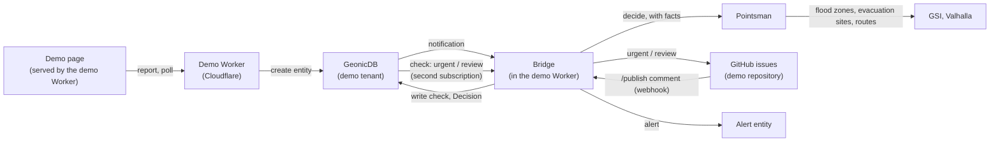

# FIWARE demo: storyboard

Issue #46. What the demo shows, for whom, and how it runs. The other issues in
the [FIWARE demo milestone](https://github.com/geolonia/pointsman/milestone/2)
build it.

## Decisions (2026-10-07)

- **Audience:** FIWARE developers and city IT staff, with a focus on disaster
  prevention and response (防災). They should understand the flow in the first
  minute, and find the real NGSI-LD data one click away.
- **Scenario:** checking reported road restrictions before they are
  published to residents. The entities are `RoadRestriction` from
  [datamodels.jp](https://datamodels.jp/models/transportation/RoadRestriction/).
- **No Docker, no servers to run.** Static pages, Cloudflare Workers, the
  GeonicDB context broker, and GitHub. See [How it runs](#how-it-runs).
- **Languages:** English and Japanese, like the landing page.

## The scenario

During heavy rain, a city's disaster headquarters receives reports of closed
or restricted roads: from field staff, patrols, other offices. Each report
becomes a `RoadRestriction` entity in the context broker. Without help,
someone at the headquarters checks every report before it appears on the
public map. On a bad day that is hundreds of reports, and the urgent ones must
not wait in the queue.

Pointsman does the first check on every report, within about a second:

| Question | Type | Why |
|---|---|---|
| `category`: which category of the national road information legend fits? | choice (10) | Reports arrive as free text; the category (通行止(異常気象等), 車線規制, …) is what the public map shows. |
| `status_matches`: does the status (closed, limited, open) match the description? | yes/no | Catches "closed" on a road that the text says is passable. |
| `danger`: are people in danger or trapped, or is emergency access blocked? | yes/no | These go to a person first, not to the queue. |
| `clarity`: is the report clear enough to publish? | score (4 levels) | Vague reports need a call back. |

And the profile turns the answers into one of three actions:

- **`urgent`**: `danger` is likely (≥ 0.7). A person looks at it now.
- **`publish`**: clear, consistent, confident category, no danger. It goes to
  the public map without waiting.
- **`review`**: everything else goes to the normal queue.

The profile is [examples/profiles/road-restriction-check.yaml](../examples/profiles/road-restriction-check.yaml).

### Tried with Clef-flash (2026-10-07)

Six reports, each run three times (`pnpm dev:live`); the answers were the same
every time, about 0.5 s per report.

| Report | Action | Answers |
|---|---|---|
| Underpass flooded by heavy rain, fully closed since 10:45, detour named | publish | closedWeather 0.96, matches 0.92, danger 0.47, clarity 2.69 |
| Landslide buried the road, a car with a person inside | **urgent** | closedWeather 0.93, danger 0.96 |
| Status "closed", but the text says one lane is open, alternating | review | alternatingOneWay 0.85, matches: **no** 0.95 |
| Water pipe works, left lane closed 9:00–17:00 | publish | laneRestriction 0.95, matches 0.85, clarity 2.60 |
| "The road seems blocked" (no road name) | review | closedWeather 0.47, clarity 1.17 |
| English: fallen tree blocks both lanes since 7 am | publish | closedWeather 0.92, clarity 2.75 |

The flooded underpass is a good example to show: the model was unsure about
danger (0.47, just under the 0.5 that `publish` allows). Showing the number
next to the action helps people understand that thresholds are a choice the
city makes, not something the model decides.

## Storyboard

The page has two map views side by side (one on top of the other on a phone):
the **headquarters view** with every report, and the **residents' view** with
only what is published.

1. **Start.** Both maps show a few existing restrictions in a small area.
   One sentence explains the situation: heavy rain, reports coming in.
   Pointsman checks each one first: clear reports go to the public map at
   once, the others go to a person.
2. **Report.** The viewer picks one of the prepared reports (the six above,
   in English and Japanese) or writes one: draw a point or line on the map,
   choose a status, write a sentence.
3. **Watch.** A timeline shows each step as it happens, with the time it took:
   1. stored in the context broker (`RoadRestriction` entity)
   2. the broker notified the bridge (subscription)
   3. Pointsman answered the four questions
   4. the result was written back to the entity (`check` property)

   Each step opens to show the real request or JSON.
4. **Result.** The report appears on the headquarters map in the colour of its
   action. The side panel shows the answers with their probabilities, and
   which rule of the profile decided the action. A `publish` report also
   appears on the residents' map.
5. **Review.** `urgent` and `review` reports become issues in a public demo
   repository on GitHub, labelled by action. A person resolves one there: a
   comment such as `/publish` or `/category laneRestriction`. The bridge sends
   that to Pointsman as feedback and updates the entity; the report moves to
   the residents' map.
6. **Learn more.** What just happened in four sentences, the profile, the
   bridge code, how to connect your own broker.

### What the viewer should take away

- Pointsman reads the entity as it is: no mapping code between the broker and
  the model, just paths in the profile.
- The decision is data in the broker: other FIWARE apps can subscribe to it
  or query it (for example `q=check=="urgent"`; the attribute name and
  format are decided in #47, following the Decision data model, #52).
- People stay in charge: the city sets the thresholds, and everything that is
  not clear goes to a person, with the reason.
- Places are checked with spatial data, not by the model: the rules read
  facts such as "inside a 3 to 5 m flood zone" or "the way around on foot is
  316 m longer" (below).

## Spatial facts and the chain

Two additions after the first version (October 2026):

- **Facts in the rules** (#64, #65, #70): for each report, Pointsman looks up
  the river flood zone (GSI hazard map tiles) and the nearest evacuation site
  (GSI). The profile `road-restriction-check` version 2 sends a report in a
  flood zone of 3 m or deeper to a person (`urgent`) when the text alone
  would only be `review`. The model never sees the facts (spike #60); the page
  lists them with their source.
- **A chain of decisions** (#66): for reports decided `urgent` or `review`, a
  second profile (`evacuation-access-check`) asks whether the closure cuts
  people off from their evacuation site. Facts: the nearest site and the way
  around on foot (Valhalla, OpenStreetMap). Near a site, with a long way
  around and no way through on foot, it raises an `Alert` (Smart Data Models)
  for the site's staff. Its `Decision` entity links step 1
  (`wasInformedBy`).

Two prepared reports show the chain with the same text: a closed bridge in
飯田橋三丁目 (+316 m on foot, evacuation site 443 m away: alert) and a street
in 飯田橋四丁目 (+143 m: no alert).

Decisions follow the Decision model on datamodels.jp
(https://datamodels.jp/models/decision/Decision/).

## How it runs

- **Demo page:** static files served by the demo Worker
  (https://pointsman-demo.geolonia.workers.dev, repository
  geolonia/pointsman-demo). It only talks to the demo Worker, never to the
  broker directly.
- **Demo Worker:** creates entities from the page (checked and limited, see
  below), returns the entities for the maps, and runs the bridge (#47) on
  `/notify`. Broker and Pointsman credentials stay in the Worker.
- **GeonicDB:** a demo tenant, with two subscriptions on `RoadRestriction`:
  new reports to `/notify`, and step 1's `urgent` and `review` results to
  `/notify?route=evacuation` (the chain). GeonicDB behaves correctly for the
  bridge's writes (#41) and supports the shared-secret header
  (`receiverInfo`).
- **Pointsman:** the production Worker, with the demo profile in the config
  repository and its own API token, limited to that profile.
- **GitHub:** issues in a public demo repository as the review queue, and a
  webhook back to the Worker for the review comments.
- **Development:** `wrangler dev` for the Worker against a GeonicDB test
  tenant. No containers. Anyone can point the bridge at another NGSI-LD
  broker; the findings in #41 say which brokers need care.

### Limits for a public demo

- Prepared reports are the default; free text is limited in length and
  protected with Cloudflare Turnstile.
- Rate limit per visitor and a daily ceiling on Pointsman calls; when it is
  reached, the page shows recorded results instead of failing.
- Entities, decisions and demo issues are deleted after a day (a cron in the
  Worker). The page asks people not to write personal data.
- Issues are only created for prepared reports, or after a person approves
  free text, so the public cannot write into the GitHub repository directly.

## Where the open points went

- #47 (bridge), #48 (environment), #49 (page): done.
- #50: the ideas list; evacuation sites and the chain became #66.
- Geocoding for reports with only an address: #65.
