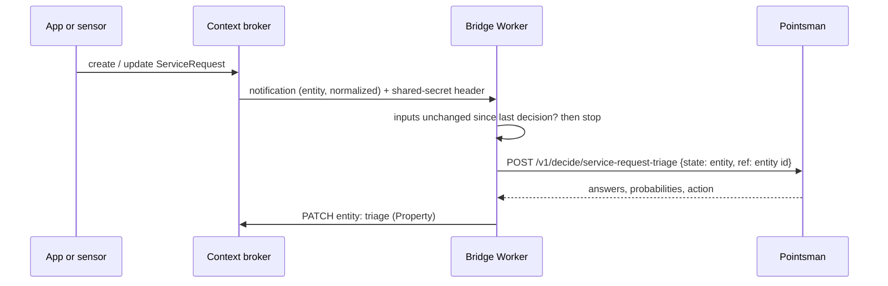

# Spike: FIWARE bridge Worker

Issue #14. Question: how should a FIWARE bridge work: NGSI-LD subscription →
bridge Worker → `/v1/decide` → PATCH a decision Property back to the entity?

**Short answer: it works with a small Worker and no change to Pointsman, but
the bridge must protect itself against notification loops.** The profile reads
the NGSI-LD entity directly, so the bridge needs no mapping code. The result
goes back as one Property with the action as its value and the evidence as
sub-properties.

Tried with Orion-LD (post-1.12.0, `fiware/orion-ld:latest` of 2026-09-25) and
MongoDB 4.4 in containers, a local Pointsman (`wrangler dev`, mock model) and
the bridge in `wrangler dev`. The bridge and the profile are in
[fiware/](fiware/).

## The flow



- **Subscription:** one per entity type, `watchedAttributes` = the attributes
  the profile reads, `format: normalized`, and the bridge's shared secret as a
  header (`endpoint.receiverInfo`). The bridge refuses notifications without it.
- **Profile:** its `input` paths read the normalized entity, for example
  `$.description.value`, so the bridge sends the entity as it is. Example:
  [service-request-triage.yaml](fiware/service-request-triage.yaml).
- **Configuration in the bridge:** entity type → profile, input attributes,
  result attribute. Nothing else.
- **Reference:** the entity id is sent as `ref`, so the decision log links back
  to the entity.

## Writing the decision back

One Property, named by the bridge configuration (here `triage`):

```json
"triage": {
  "type": "Property",
  "value": "auto",
  "observedAt": "2026-10-06T16:09:35.736Z",
  "decisionId": { "type": "Property", "value": "7d20731d-…" },
  "profile": { "type": "Property", "value": "service-request-triage" },
  "profileVersion": { "type": "Property", "value": 1 },
  "model": { "type": "Property", "value": "clef-flash" },
  "department": { "type": "Property", "value": "roads" },
  "departmentProbability": { "type": "Property", "value": 0.9 },
  "safety": { "type": "Property", "value": false },
  "safetyProbability": { "type": "Property", "value": 0.8 },
  "inputHash": { "type": "Property", "value": "bb8df2…" }
}
```

- **The value is the action** (`auto`, `review`, …), so a consumer that only
  needs to know what to do reads `triage.value`, and subscriptions or queries
  can filter on it (`q=triage==review`).
- **The evidence is in sub-properties:** decision id (to fetch the full record
  or send feedback), profile and version, model, each answer with its
  probability.
- **One level only.** A third level (a `probability` inside `department`) was
  silently dropped by Orion-LD, hence `departmentProbability`.
- **`observedAt`** is the decision time, so temporal queries show the history
  of decisions on the entity.

## Loops: the main finding

The bridge writes to the entity it was notified about. The subscription
watches only `name` and `description`, so the write should not notify again.
In this Orion-LD build it did: most `PATCH` or `POST` writes to other
attributes still sent a notification. A single update of the description
produced 440 decisions in a few seconds before the subscription was deleted.

The bridge now guards itself: it stores a hash of the input attributes
(`inputHash`) with the result, and ignores a notification whose inputs have
that hash. With the guard: create → 1 decision, update → 1 more, then quiet.
Any bridge, for any broker, should have such a guard; `watchedAttributes`
alone is not enough. (Whether this is an Orion-LD bug should be checked
against other brokers, GeonicDB included, before reporting it.)

Pointsman's decision log has a state hash too (`state_hash`), but the bridge
cannot use it without an extra call, so the hash on the entity is simpler.

## Relation to a `Decision` data model (#16)

Two ways to publish decisions in a context broker:

1. **A Property on the entity** (this spike): simplest for consumers, one place
   to look, history through `observedAt` and temporal queries.
2. **A `Decision` entity** per decision, with a Relationship from the entity
   (`triage` → `urn:ngsi-ld:Decision:<id>`): complete and queryable across
   entities (all `review` decisions today), and it would follow the data model
   from #16.

They combine well: the Property for the action and the key answers, and,
where needed, a `Decision` entity with the full record. The sub-property names
above should follow whatever #16 decides.

## Recommendation

- Build the bridge as its own small Worker (or a route in the Pointsman
  Worker later), configured per entity type; profiles read the entity
  directly.
- Always guard against loops with an input hash; never rely on
  `watchedAttributes` alone.
- Authenticate notifications with a shared secret header; the bridge holds a
  Pointsman API token limited to its profiles.
- Write one Property with the action as value and one level of
  sub-properties; align names with #16.
- Not covered here: retries when Pointsman or the broker is down (not tested
  whether the broker retries failed notifications; a queue would), `@context`
  handling for non-core attribute names, and multi-tenancy (`NGSILD-Tenant`).
